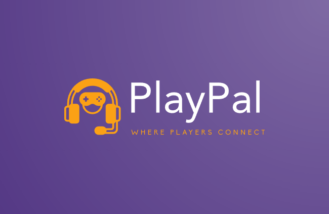

    
    <h1>PlayPal, Where Players Connect</h1>
    <h3>
        <a href="./assets/preview.mp4">
        Watch Preview Video
        </a>
    </h3>

    A Social Networking App for Gamers

## 🧐 Introduction 

PlayPal is a social networking Android app for gamers, connecting players globally and fostering friendships. The app allows users to add friends, chat with them, and manage their profiles. Users can also create and join groups, participate in group chats, browse collections of games, and share their gaming experiences with others.

## ⛏️ Technologies Used

<table>
    <thead>
        <tr>
            <th>Property</th>
            <th>Badges</th>
        </tr>
    </thead>
    <tbody>
        <tr>
            <td>📋 Languages</td>
            <td>
                
                
            </td>
        </tr>
        <tr>
            <td>☁️ Backend & Database</td>
            <td>
                
            </td>
        </tr>
        <tr>
            <td>🔧 Build Tools</td>
            <td>
                
            </td>
        </tr>
        <tr>
            <td>🚀 Environment</td>
            <td>
                
                
            </td>
        </tr>
    </tbody>
</table>

## 🎈 Features 

- [x] **User Profile:** Users can create and manage their profiles. They can set their username display name, and about me information. They can also upload a profile picture.
- [x] **Friend Management:** Users can send friend requests to other users. If the friend request is accepted, they become friends. Users can also remove friends from their friend list.
- [x] **Chat:** Users can chat with their friends. The chat feature is likely to be real-time.
- [x] **Settings:** Users can access a settings page where they can update their profile information.
- [x] **Game Details:** Users can view detailed information about games, including the game's name, rating, release date, genres, and platforms. Users can also add games to their favorites or remove them from their favorites.
- [x] **Home Screen:** The home screen provides navigation to various features of the app, including the user's profile, notifications, games, chats, and search.
- [x] **Search:** Users can search for other users, games, and chat rooms.
- [x] **Notifications:** Users can view notifications.

## 🙏 Acknowledgements 

- [**Looka**](https://looka.com/) for the logo design.
- [**Realtime Colors**](https://www.realtimecolors.com/) for the color palette.
- [**Flaticon**](https://www.flaticon.com/) for some of the icons used in the app.
- [**RAWG API**](https://rawg.io/apidocs) for the game data.

## 📄 License 

This project is licensed under the MIT License - see the [LICENSE](LICENSE) file for details.

## 🎉 Contributors 

